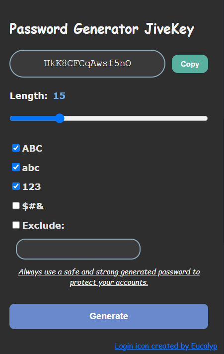

# JiveKey

## Description
This Password Generator Extension helps you create strong, secure passwords quickly and easily.

## Features
- **Generate Passwords**: Create complex and unique passwords.
- **Customization**: Adjust length and complexity based on your needs.
- **Copy to Clipboard**: Easily copy generated passwords for use.
- **Exclude**: Exclude specific characters or types.

## Installation
### From GitHub
1. **Download the ZIP File**: Go to the GitHub repository (https://github.com/Yawlf/JiveKey) and click on the "Code" button, then select "Download ZIP."
2. **Extract the ZIP**: Unzip the downloaded file on your computer.
3. **Open Extension Settings**: Go to your browser's extension settings (this may vary by browser).
4. **Enable Developer Mode**: Turn on "Developer mode" or "Load unpacked" (exact wording may vary).
5. **Load the Extension**: Click "Load unpacked" or "Add unpacked extension" and select the folder where you extracted the ZIP file.

## License

This project is licensed under the MIT License.
